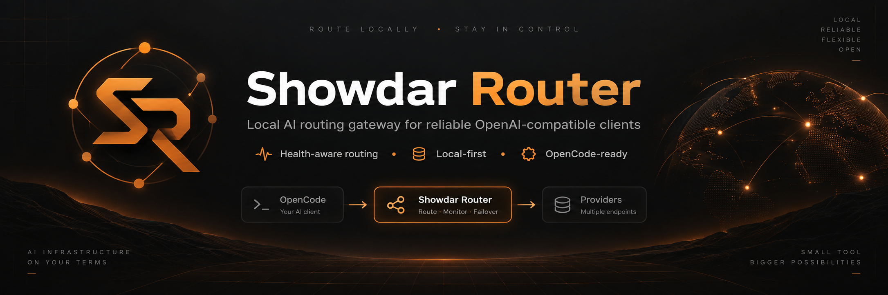
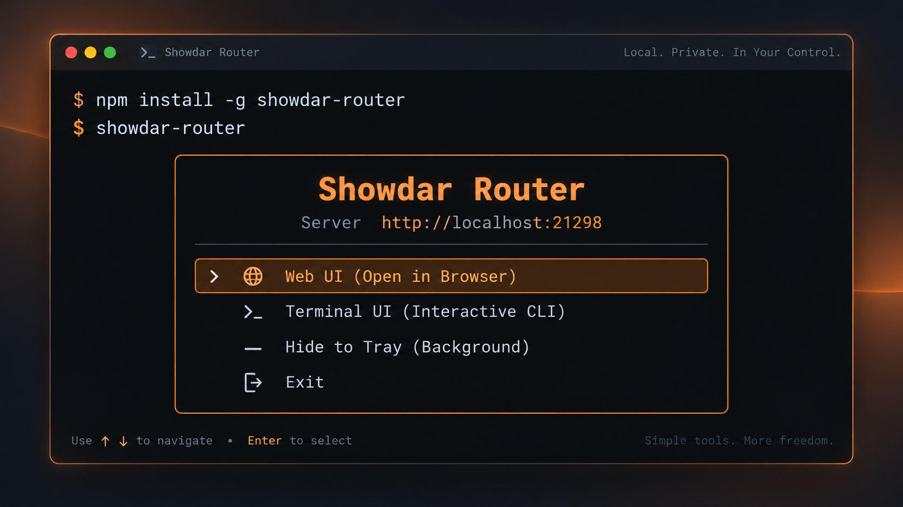
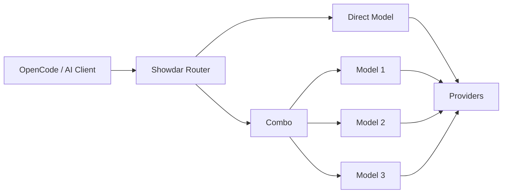
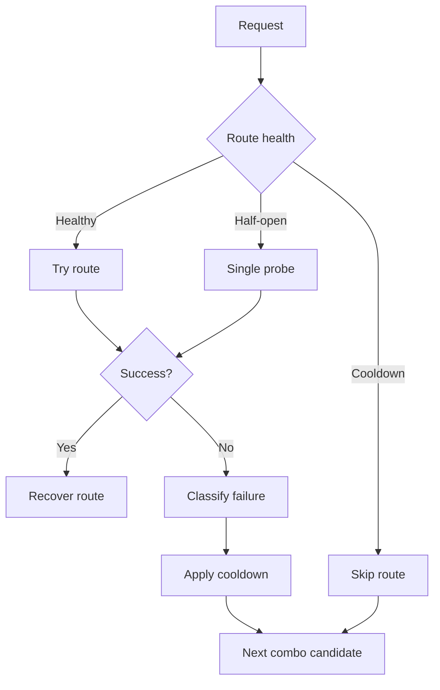
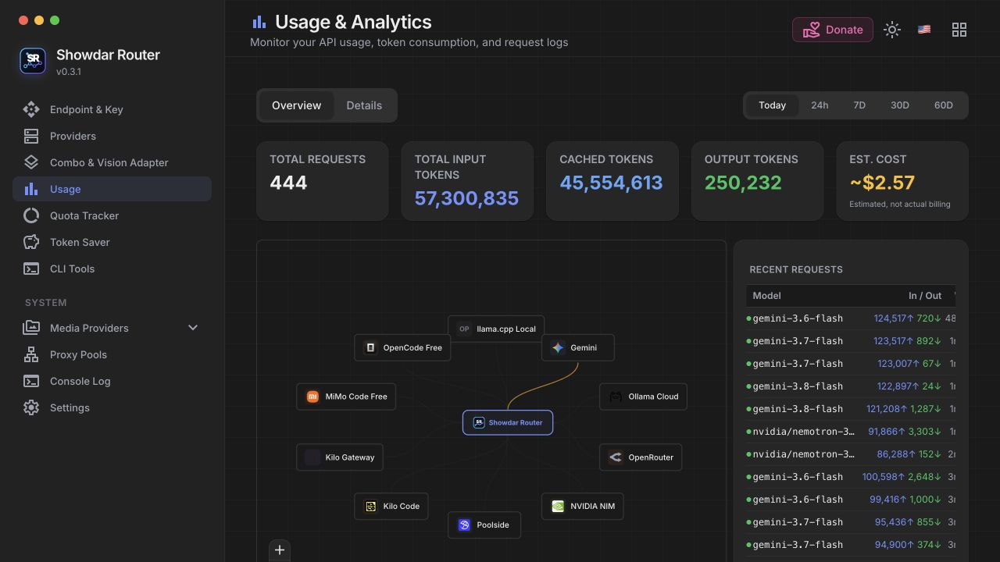
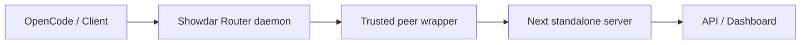

<p align="center">
  
</p>

<p align="center">
  <strong>Local-first AI routing gateway for OpenCode and OpenAI-compatible clients.</strong>
</p>

<p align="center">
  OpenAI-compatible · Health-aware routing · Ordered fallback · Local-first
</p>

---

Showdar Router gives your AI tools a single local endpoint for multiple providers, credentials, models, and fallback combinations.

Configure your providers once, create a direct model or combo, then point OpenCode or any compatible client at:

```text
http://127.0.0.1:21298/v1
```

## Quick Start

Install globally:

```bash
npm install -g showdar-router
```

Launch:

```bash
showdar-router
```

<p align="center">
  
</p>

The interactive launcher lets you open the dashboard, use the terminal UI, or keep Showdar Router running from the system tray.

Default dashboard:

```text
http://localhost:21298
```

Suggested free models are discovered dynamically from registered provider
catalogs. Showdar Router contacts only those trusted catalog endpoints and
caches successful discovery results briefly.

## Why Showdar Router?

Instead of configuring every AI client against every provider separately:



Showdar Router acts as the local routing layer between your tools and upstream providers.

It provides:

- One OpenAI-compatible local API.
- Multiple providers and credentials.
- Direct model routing.
- Ordered model combos with fallback.
- Health-aware cooldown and recovery.
- Provider and account fallback where supported.
- Retry and provider reset metadata handling.
- Usage and quota visibility where available.
- Web dashboard, CLI, terminal UI, and system tray.

## Routing

Combo candidates preserve their configured order after routing eligibility is
known. Requests with hard input requirements (vision, PDF, audio, or video)
never fall back to a model that cannot receive that data; unavailable routes
are then skipped using read-only health inspection followed by a single
half-open acquisition at attempt time.

Round-robin combos rotate only among eligible candidates and keep the cursor
stable when a route fails. Fusion uses a bounded panel (four concurrent calls
by default), cancels stragglers after quorum, and reuses a lone successful
panel response instead of making a duplicate provider call.

For example:

```text
coding-fast

1. gemini/gemini-3.7-flash
2. gemini/gemini-3.6-flash
3. ollama/minimax-m3
4. nvidia/nemotron-3-ultra-550b-a55b
5. openrouter/...
6. opencode/...
```

If a route becomes temporarily unavailable:



Showdar Router can classify and recover from conditions such as:

- quota exhaustion
- subscription requirements
- authentication failures
- unsupported models
- missing models
- provider capacity
- network failures
- timeouts

Where available, provider recovery metadata such as `Retry-After`, retry delays, and reset timestamps is used instead of repeatedly probing a route that is known to be unavailable.

Showdar Router does **not** reorder combo candidates based on latency.

## Port Selection

The default port is:

```text
21298
```

Normally:

```text
Dashboard  http://localhost:21298
API        http://127.0.0.1:21298/v1
```

### Automatic fallback

If the default port is already occupied and you did not explicitly select a port, Showdar Router automatically searches the next available port.

Example:

```console
$ showdar-router start

⚠ Port 21298 is already in use
✓ Using fallback port 21299

Dashboard  http://localhost:21299
API        http://127.0.0.1:21299/v1
```

The search starts at `21298` and checks up to ten candidate ports.

Check the active port at any time:

```bash
showdar-router status
```

### Explicit port

Use `--port` or `-p` when you need a stable port:

```bash
showdar-router --port 30000
```

If `30000` is already occupied, startup fails:

```text
Error: Port 30000 is already in use.
```

Showdar Router will **not** silently switch away from an explicitly requested port.

This prevents client configuration from unexpectedly pointing at the wrong endpoint.

## OpenCode Setup

Start Showdar Router:

```bash
showdar-router
```

Configure at least one provider and model or combo from the dashboard.

Then configure your OpenAI-compatible client to use:

```text
http://127.0.0.1:21298/v1
```

For example, if your combo is named:

```text
coding-fast
```

use `coding-fast` as the model identifier from your client.

If Showdar Router selected a fallback port:

```console
$ showdar-router status

Showdar Router: running
URL: http://localhost:21299
```

use:

```text
http://127.0.0.1:21299/v1
```

instead.

### Router API key

Provider credentials and the Showdar Router client API key are separate concepts.

When **Require API Key** is disabled, trusted clients running locally can access the local LLM endpoint without a Showdar Router API key.

When **Require API Key** is enabled, clients must provide a valid Showdar Router key.

Example client options:

```json
{
  "baseURL": "http://127.0.0.1:21298/v1",
  "apiKey": "sk-showdar-example"
}
```

Never commit real provider credentials or router API keys.

## Interactive Launcher

Running:

```bash
showdar-router
```

from an interactive terminal opens the launcher:

```text
╭─────────────────────────────────────────────╮
│ Showdar Router                              │
│ Server  http://localhost:21298              │
├─────────────────────────────────────────────┤
│ › Web UI                                    │
│   Terminal UI                               │
│   Hide to Tray                              │
│   Exit                                      │
╰─────────────────────────────────────────────╯
```

Available interfaces:

**Web UI** opens the dashboard in your browser.

**Terminal UI** opens the interactive CLI.

**Hide to Tray** keeps the daemon running and attaches the system tray controller.

**Exit** closes the launcher without stopping an already-running daemon.

In non-interactive environments, running without arguments starts the daemon directly.

## CLI

Start the server:

```bash
showdar-router start
```

Stop it:

```bash
showdar-router stop
```

Restart it:

```bash
showdar-router restart
```

Check status and the actual active port:

```bash
showdar-router status
```

Read logs:

```bash
showdar-router logs
```

Follow logs:

```bash
showdar-router logs -f
```

Open the tray controller:

```bash
showdar-router tray
```

or:

```bash
showdar-router --tray
showdar-router -t
```

Use a custom port:

```bash
showdar-router --port 30000
```

Version:

```bash
showdar-router version
```

Help:

```bash
showdar-router help
```

## System Tray

The tray is a lightweight control plane for the existing Showdar Router daemon.

It does **not** launch a second server.

Typical tray actions include:

```text
Showdar Router
────────────────────
Running · :21298

Open Dashboard
Open Logs
Restart Server
Stop Server
────────────────────
Quit Tray
```

`Quit Tray` closes only the tray process.

`Stop Server` explicitly stops the Showdar Router daemon.

If the daemon is using an automatic fallback port, the tray resolves and displays the actual active port.

## Dashboard

The dashboard provides configuration and visibility for the current Showdar Router runtime.



Main areas include:

| Area                   | Purpose                                        |
| ---------------------- | ---------------------------------------------- |
| Endpoint & Key         | Local endpoint and client access               |
| Providers              | Provider connections and credentials           |
| Combo & Vision Adapter | Model combinations and routing                 |
| Usage                  | Request and token usage                        |
| Quota Tracker          | Provider quota information                     |
| Token Saver            | Token optimization controls                    |
| CLI Tools              | CLI integrations and configuration             |
| Media Providers        | Embedding, image, video, TTS, STT and web APIs |
| Proxy Pools            | Proxy configuration                            |
| Console Log            | Runtime logs                                   |
| Settings               | Router configuration                           |

Availability depends on the provider and enabled features.

## Health-Aware Recovery

Showdar Router keeps route health separate from credential/account health.

A route can transition through:

```text
healthy
   │
   ▼
cooldown
   │
   ▼
half-open
   │
   ├── success ──► healthy
   │
   └── failure ──► cooldown
```

Only one half-open probe is allowed for a recovering route at a time.

When a provider returns an explicit recovery hint, Showdar Router can use information such as:

```text
resetAt
resetsAt
Retry-After
retryDelay
retryAfter
X-RateLimit-Reset
```

before falling back to bounded internal cooldown behavior.

This avoids repeatedly calling providers that have already communicated when they will become available again.

## Empty Response Fallback

An HTTP `200` response does not necessarily mean a usable chat completion was produced.

For streaming chat requests, a response with no meaningful content, reasoning, or tool frames can be treated as a failed route.

The combo may then continue to the next candidate instead of returning an empty successful response to the client.

## Security

Showdar Router distinguishes trusted local requests from remote requests.

Disabling **Require API Key** is intended for trusted local access. It does not automatically make LAN, tunnel, reverse-proxy, or public traffic trusted.

Production requests pass through:



The wrapper derives trusted local-peer information from the actual connection rather than blindly trusting client-supplied host or forwarding headers.

Spoofing headers such as a localhost host name or loopback forwarded address is not sufficient to gain trusted-local status.

For remote client access, enable **Require API Key** and configure network exposure deliberately.

Do not expose an unsecured Showdar Router API directly to the public internet.

## Data & Runtime

Default data directory:

```text
~/.showdar-router
```

Runtime state:

```text
~/.showdar-router/run/
```

Default PID file:

```text
~/.showdar-router/run/showdar-router.pid
```

Logs:

```text
~/.showdar-router/logs/showdar-router.log
```

The runtime state also tracks the actual active port when automatic port fallback is used.

## Development

Clone the repository:

```bash
git clone https://github.com/caongocquy/showdar-router.git
cd showdar-router
```

Install dependencies:

```bash
npm install
```

Run in development:

```bash
npm run dev
```

Build production assets:

```bash
npm run build
```

Install the local CLI from the checkout:

```bash
./scripts/install-local.sh
```

Then:

```bash
showdar-router
```

Docker is not required for the supported Showdar Router runtime.

## Environment

Canonical Showdar Router environment variables include:

```text
SHOWDAR_ROUTER_PORT
SHOWDAR_ROUTER_DATA_DIR
```

Defaults:

```text
SHOWDAR_ROUTER_PORT=21298
SHOWDAR_ROUTER_DATA_DIR=~/.showdar-router
```

CLI arguments take precedence where applicable.

## Testing

Run the focused routing release gate:

```bash
npm run test:routing
```

It covers the fork's critical routing behavior, including:

- combo fallback
- route health
- recovery metadata
- account/provider fallback
- retry behavior
- empty response handling

Run the production runtime smoke test:

```bash
npm run test:runtime
```

Build from a clean Next output:

```bash
rm -rf .next
npm run build
```

The inherited upstream broad test suite can also be run with:

```bash
npm test
```

The broad inherited suite is not represented as the primary Showdar Router release gate.

## Supported Runtime

The primary user flow is:

```text
npm install -g showdar-router
        │
        ▼
   showdar-router
        │
        ▼
 CLI / Launcher / Tray
        │
        ▼
       Daemon
        │
        ▼
 Trusted peer wrapper
        │
        ▼
 Next standalone server
        │
        ▼
 OpenAI-compatible API
```

The supported distribution target is the local npm/CLI installation.

## Upstream

Showdar Router originated as an independent fork of [decolua/9router](https://github.com/decolua/9router) and is now maintained as its own product.

The project preserves upstream attribution and compatibility where appropriate while maintaining its own product identity, runtime, routing behavior, and release process.

Showdar Router is not affiliated with OpenAI, OpenCode, Anthropic, Google, NVIDIA, Ollama, OpenRouter, or other providers referenced by the project.

## License

Licensed under the [MIT License](https://github.com/caongocquy/showdar-router/blob/main/LICENSE).

Showdar Router is based on the upstream project. Upstream copyright and
license notices are preserved.
